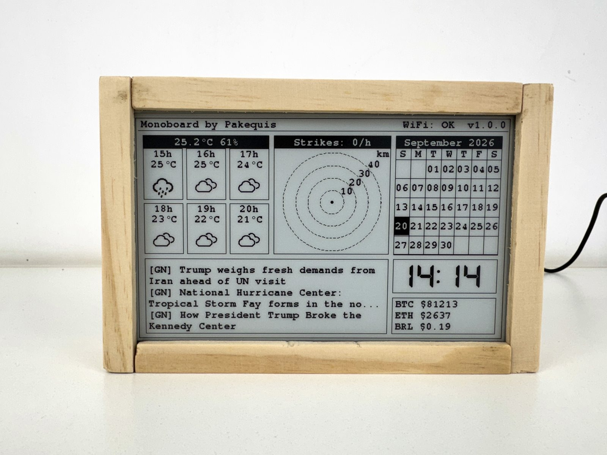
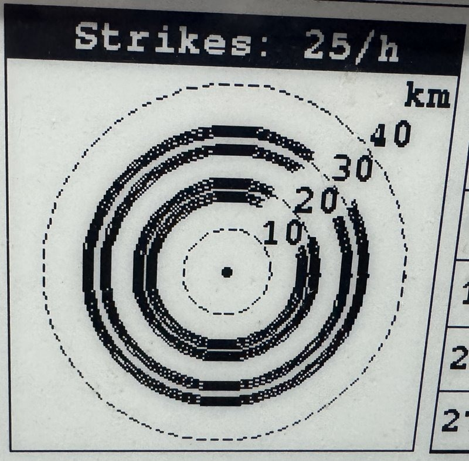
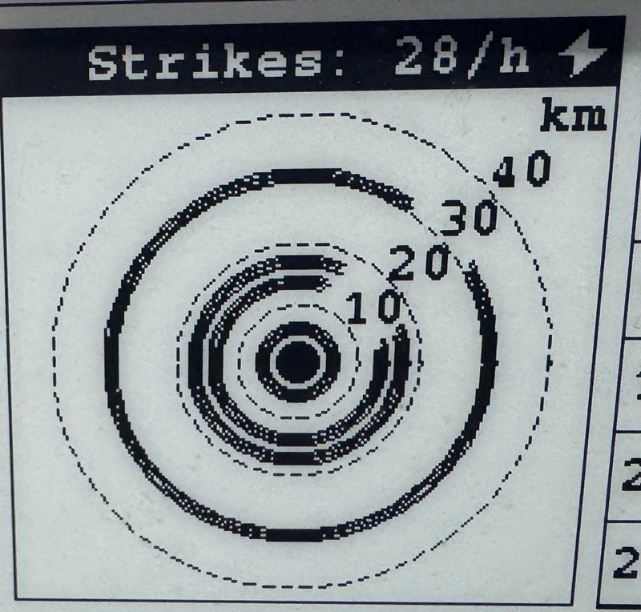
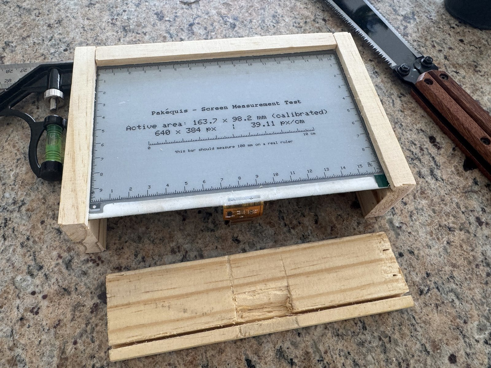
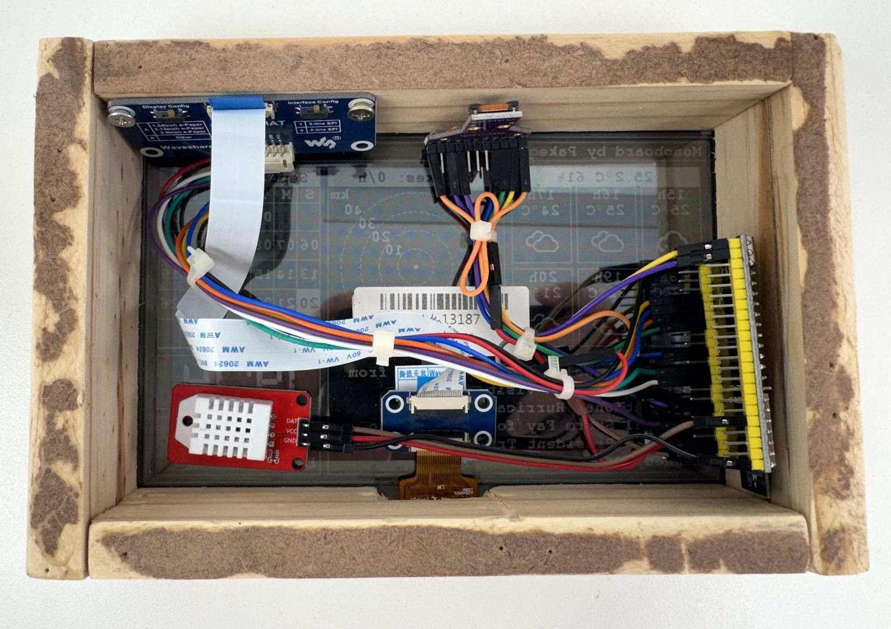

## Important warning

**This project is experimental.** Sensor data collected (temperature, humidity, etc.) **are not highly accurate** and should be used only as reference, **not as critical data**.

# Monoboard

I've had this Waveshare 7.5" e-paper display sitting since 2019, waiting for a project to use it for. This is that project, better late than never.

Firmware project for a dashboard on the same e-paper display, driven by an ESP32-S3 DevKitC-1. There's no footer: a one-line header shows the title, WiFi status, and firmware version. Below it, a 2×2 content grid shows weather forecast + local temperature/humidity, a lightning-strike distance/rate box (AS3935), and a monthly calendar on top; a DSEG7 seven-segment clock (synced via NTP, with a BTC/ETH/USD-BRL crypto quotes box below it) and a rotating news-headline carousel on the bottom. Every display-facing string switches between PT-BR/EN at compile time (`include/strings.h`). The board wakes from deep sleep on a timer (`DEEP_SLEEP_INTERVAL_SEC`, currently `60`s, the confirmed production value) or the AS3935 lightning sensor's IRQ pin, redraws, and goes back to sleep.

## Functionalities

- **E‑paper display**: Waveshare 7.5″ (640 × 384 px, landscape). All content is refreshed via `updateScreen()` in paged mode.
- **Deep‑sleep power saving**: The board sleeps for `DEEP_SLEEP_INTERVAL_SEC` (currently 60 s) and wakes on timer or the AS3935 lightning sensor’s IRQ pin (`ext1`).
- **Weather forecast**: Pulls 6‑hour forecast from Open‑Meteo (temperature, weather codes, day/night icons). Labels and month/weekday names are displayed in Portuguese or English per `APP_LANGUAGE`.
- **Local sensors**: DHT22 (temperature / humidity).
- **Lightning detection**: SparkFun AS3935 detects strikes and shows an adaptive distance scale (rings at 10/20/30/40 km, tightening to 4/6/8/10 km for a close storm), a strikes-per-hour count in the box header (sliding 1-hour window), and a 5‑entry strike history in RTC memory. The front end runs in `OUTDOOR` gain, not the chip’s `INDOOR` power-on default: at this location `INDOOR` overdrove the analog front end and real storms registered as nothing. The noise-rejection thresholds are also tightened above their permissive defaults so local electrical transients don’t register as strikes; see `docs/Lightning Detection.md`.

 
- **Screen measurement mode**: A build-time flag (`SHOW_SCREEN_RULER`, or the `screen_ruler` PlatformIO env) replaces the dashboard with calibrated centimetre rulers on every edge plus a 10 cm calibration bar, latched on the panel for use as a 1:1 physical template; see `docs/Screen Measurement Mode.md`.
- **Monthly calendar**: Shows the current month with weekday and month names translated.
- **Seven‑segment clock**: DSEG7 Classic Bold font, synced via NTP; displays `HH:MM` in the bottom‑right quadrant.
- **Crypto quotes**: BTC and ETH prices (BRL or USD per `APP_LANGUAGE`) plus a derived USD‑BRL FX rate, fetched from CoinGecko and shown below the clock. Enabled/disabled via `FEATURE_CRYPTO_ENABLED`.
- **News carousel**: Rotating carousel of headlines from Google RSS (PT‑BR or EN locale). Enabled/disabled via `FEATURE_NEWS_ENABLED`.
- **Compile‑time language switch**: Change `#define APP_LANGUAGE LANG_PT_BR` to `LANG_EN` in `config.h` (or pass `-D APP_LANGUAGE=LANG_EN`) to switch all UI strings without touching code.
- **String catalog**: All user‑facing strings live in `include/strings.h` with separate blocks for Portuguese and English (weekdays, months, labels, warnings, etc.).
- **Power management**: After screen update the ESP32‑S3 enters deep sleep drawing ~5‑10 µA; Wi‑Fi is only powered on when a sync window is due (NTP resync every hour).
- **Anti-ghosting conditioning**: Every ~12 h of redraws (and once per cold boot), the panel is flushed with a few black↔white full-refresh cycles before the dashboard is drawn, to clear the ghosting the GDEW075T8 accumulates in static regions over weeks of continuous use. Tunable via `DISPLAY_CONDITION_*` in `config.h`; see `docs/API Reference.md`.

## Docs Structure

| File | Description |
|---------|-----------|
| `docs/Pin Mapping.md`   | ESP32 and ESP32-S3 pin mapping for the display and sensors |
| `docs/API Reference.md` | Code usage guide: available functions and examples |
| `docs/Internationalization.md` | PT-BR/EN string-switching mechanism: keys, constraints, how to add strings/languages |
| `docs/Lightning Detection.md` | AS3935 IRQ wake, the strikes/hour metric, noise-rejection tuning, the `as3935_monitor` diagnostic build |
| `docs/Screen Measurement Mode.md` | `SHOW_SCREEN_RULER`: edge rulers + calibrated 10 cm bar latched on the panel as a physical template |
| `docs/Enclosure Build.md` | Pine wood frame around the e-paper panel: piece dimensions, groove assembly |

## Technologies

- **Platform**: PlatformIO
- **Framework**: Arduino (ESP32-S3; `esp32-s3-devkitc-1` is the production firmware env: see `platformio.ini`). A separate `native` environment (no board, no Arduino) runs host-compiled Unity unit tests for a few pure-logic modules: `pio test -e native`.
- **Extra build environments** (`platformio.ini`): `screen_ruler`: the production binary with `-DSHOW_SCREEN_RULER=1` (see `docs/Screen Measurement Mode.md`); `as3935_monitor` (plus `as3935_monitor_loose` / `as3935_monitor_outdoor` variants) and `wifi_lightning_noise_test`: standalone diagnostic sketches for the lightning sensor (see `docs/Lightning Detection.md`). None of these are flashed as the normal firmware.
- **Build flags**: `APP_DEBUG_SERIAL` (serial logging on/off, default off), `SHOW_SCREEN_RULER` (default off), `APP_LANGUAGE` (`LANG_PT_BR`/`LANG_EN`): all in `config.h` under `#ifndef`, so a `-D` flag overrides without editing the file.
- **Display**: Waveshare 7.5" (GxEPD2_750): 640×384 px
- **Libraries**: GxEPD2, Adafruit GFX, Adafruit BusIO, ArduinoJson, DHT sensor library, Adafruit Unified Sensor, SparkFun AS3935 Lightning Detector, WiFi, HTTPClient (all in `platformio.ini`'s `lib_deps` except the last two, which ship with the Arduino-ESP32 core)

## Hardware

Confirmed via `esptool flash_id`:

- **Chip**: ESP32-S3 (QFN56), revision v0.2, WiFi + BLE, 40MHz crystal
- **Flash**: 16MB (Winbond, quad SPI, 3.3V)
- **PSRAM**: 8MB embedded (octal), enabled (`board_build.arduino.memory_type = qio_opi` + `-DBOARD_HAS_PSRAM` in `platformio.ini`) and confirmed working on real hardware. The full 16MB of flash is usable via `board_build.partitions = default_16MB.csv` + `board_upload.flash_size = 16MB` in `platformio.ini`: both keys are required, since the espressif32 build script sizes the flashed image header from `board_upload.flash_size` specifically, not `board_build.flash_size`; with only the latter set, the bootloader stays capped at the board's 8MB default regardless of the partition table.

## Notes

1. Tuning the lightning sensor's gain took four separate thunderstorms across three weeks, because the only way to test it is to wait for an actual storm and see what the chip logs. Three storms in a row came back with zero detected strikes despite audible thunder, until the cause turned out to be a single register: the chip powers on in `INDOOR` gain, and at this location that setting saturates the front end. Switching to `OUTDOOR` mid-storm took it from zero to 66 lightning events in 14 minutes. `as3935_monitor_loose` is still sitting in `platformio.ini`, waiting for whichever storm shows up next.
2. The pine wood enclosure in `docs/Enclosure Build.md` came out rustic. I'm not much of a carpenter.

## Contact

Feel free to reach out to me on social media: @pakequis in any of them...

You can also send me an email at pakequis (Gmail).
