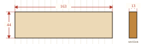
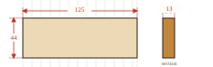

# Enclosure Build

The dashboard sits in a small pine wood frame built around the e-paper panel.

## Pieces

| Piece | Role             | Length × Width × Thickness | Qty |
|-------|------------------|-----------------------------|-----|
| A     | Top / bottom rail | 163 × 44 × 13 mm            | 2   |
| B     | Side rail         | 125 × 44 × 13 mm            | 2   |

Material: pine. Cuts were guided by the on-screen ruler from `docs/Screen Measurement Mode.md` (`SHOW_SCREEN_RULER`), latched on the panel and used as a 1:1 physical template.

## Scaled drawings

Dimensions in millimetres, drawings to scale within each diagram.

### Piece A: top/bottom, 163 × 44 × 13 (×2)

### Piece B: sides, 125 × 44 × 13 (×2)

## Assembly

The top rail and the two side rails are glued and nailed together into a fixed U shape. A channel is carved into the inner face of each of these three pieces. The e-paper panel's edges slide into that channel from the open bottom.

The bottom rail is not glued or nailed: it stays loose so the frame can be opened. To assemble, the panel slides down into the channels of the fixed U, then the bottom rail closes underneath to hold it in place.

There is no corner joinery (no miter, no notch) between the four wood pieces themselves: the rails simply butt against each other at the corners.

## Stock

2×163 + 2×125 = 576 mm of linear pine stock at 44 mm width covers the four pieces (not accounting for saw kerf between cuts).

## Photos

The channel-cut U frame dry-fit around the panel, using `docs/Screen Measurement Mode.md`'s on-screen ruler (still latched on the panel) to check the fit before gluing:

Wiring inside the closed frame, before the bottom rail goes back on: the Waveshare driver HAT top-left, the DHT22 bottom-left, and the ESP32-S3 header on the right.

## Open items

- Finish (paint, oil, or raw wood) not yet decided.
